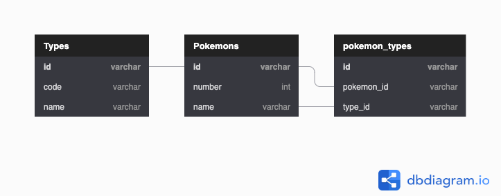

# Pokemon RESTAPI

This repository is for Pahamify recruitment for intern back-end position, but i don't get any reply from them, since it's been around 10 months ago, i make it public. This is my first time using Go too.

## Technology used
- Language: Golang v1.15.7
- Framework: gin-gonic/gin v1.16.3
- Database: MariaDB v10.5
- ORM: gorm v1.21.3

## How to Run

**First, make sure to fill appropriate database credentials in .env file**

### With Docker

#### Build

Build project with docker-compose
```shell
docker-compose build
```

#### Run
```shell
docker-compose up
```

API server on port :8080, database on port :3306, and PHPMyAdmin on port :8000

### Without Docker

#### Build

1. Build project first
```shell
GIN_MODE=release go build -o restapi
```

2. Create a new database with db name "pokemon" on MySQL or MariaDB
3. Then run binary with command below

#### Run

Run project with
```shell
./restapi
```


## API Specification

### Type

#### List Types
**Request:**
- Method: GET
- Endpoint: /api/types
- Header:
  - Accept: application/json
- Query Param:
  - limit: number (mandatory; default=0)

**Request example:**  
`http://localhost:8080/api/types?limit=2`

**Response:**
```json
{
  "data": {
    "types": [
      {
        "uuid": "10bb7657-92cd-448f-a329-c6b548085105",
        "code": "ghost",
        "name": "Ghost"
      },
      {
        "uuid": "13a87ba0-9e29-4649-8880-0878fbf61890",
        "code": "flying",
        "name": "Flying"
      }
    ]
  }
}
```

#### Get Type
**Request:**
- Method: GET
- Endpoint: /api/types/{uuid}
- Header:
  - Accept: application/json

**Request Example:**
`http://localhost:8080/api/types/267da74d-975e-417a-aeb4-594c0c3a5a9f`

**Response:**
```json
{
  "data": {
    "code": "grass",
    "name": "Grass",
    "uuid": "267da74d-975e-417a-aeb4-594c0c3a5a9f"
  }
}
```

#### Create New Type

**Request:**
- Method: POST
- Endpoint: /api/types
- Header:
  - Accept: application/json
  - Content-Type: application/json
- Body:
```json
{
  "code": "grass",
  "name": "Grass"
}
```

**Response:**
```json
{
  "code": 200,
  "uuid": "c7796ef4-03fa-4be4-ac16-8960b0d4791a",
  "message": "OK"
}
```

#### Update Pokemon

**Request:**
- Method: PUT
- Endpoint: /api/types
- Header:
  - Accept: application/json
  - Content-Type: application/json
- Body:
```json
{
  "uuid": "57072197-e96e-4bf7-83e9-23c740183216",
  "code": "grass",
  "name": "Grass"
}
```

**Response:**
```json
{
  "code": 200,
  "message": "OK",
  "uuid": "57072197-e96e-4bf7-83e9-23c740183216"
}
```

#### Delete Type

**Request:**
- Method: DELETE
- Endpoint: /api/types/{uuid}
- Header:
  - Accept: application/json

**Request Example:**
`http://localhost:8080/api/types/267da74d-975e-417a-aeb4-594c0c3a5a9f`

**Response:**
```json
{
  "code": 200,
  "message": "OK"
}
```

### Pokemon

#### List Pokemons
**Request:**
- Method: GET
- Endpoint: /api/pokemons
- Header:
  - Accept: application/json
- Query Param:
  - limit: number (mandatory; default=0)

**Request example:**  
`http://localhost:8080/api/pokemons?limit=2`

**Response:**
```json
{
  "data": {
    "pokemons": [
      {
        "name": "Bulbasaur",
        "number": "001",
        "types": [
          "Grass",
          "Poison"
        ],
        "uuid": "267da74d-975e-417a-aeb4-594c0c3a5a9f"
      },
      {
        "name": "Ivysaur",
        "number": "002",
        "types": [
          "Grass",
          "Poison"
        ],
        "uuid": "23d9de4f-a3c3-44b4-ac70-0310ee39e4e5"
      }
    ]
  }
}
```

#### Get Pokemon
**Request:**
- Method: GET
- Endpoint: /api/pokemons/{uuid}
- Header:
    - Accept: application/json

**Request Example:**
`http://localhost:8080/api/pokemons/267da74d-975e-417a-aeb4-594c0c3a5a9f`

**Response:**
```json
{
  "data": {
    "name": "Bulbasaur",
    "number": "001",
    "types": [
      "Grass",
      "Poison"
    ],
    "uuid": "267da74d-975e-417a-aeb4-594c0c3a5a9f"
  }
}
```

#### Create New Pokemon

**Request:**
- Method: POST
- Endpoint: /api/pokemons
- Header:
    - Accept: application/json
    - Content-Type: application/json
- Body:
```json
{
  "number": "001",
  "name": "Bulbasaur",
  "types": [
    "grass",
    "poison"
  ]
}
```
    
**Response:**
```json
{
  "code": 200,
  "uuid": "c7796ef4-03fa-4be4-ac16-8960b0d4791a",
  "message": "OK"
}
```

#### Update Pokemon

**Request:**
- Method: PUT
- Endpoint: /api/pokemons
- Header:
    - Accept: application/json
    - Content-Type: application/json
- Body:
```json
{
  "uuid": "57072197-e96e-4bf7-83e9-23c740183216",
  "number": "001",
  "name": "Bulbasaur",
  "types": [
    "grass",
    "poison",
    "earth"
  ]
}
```

**Response:**
```json
{
  "code": 200,
  "message": "OK",
  "uuid": "57072197-e96e-4bf7-83e9-23c740183216"
}
```

#### Delete Pokemon

**Request:**
- Method: DELETE
- Endpoint: /api/pokemons/{uuid}
- Header:
    - Accept: application/json
  
**Request Example:**
`http://localhost:8080/api/pokemons/57072197-e96e-4bf7-83e9-23c740183216`

**Response:**
```json
{
  "code": 200,
  "message": "OK"
}
```

## Database Diagram


